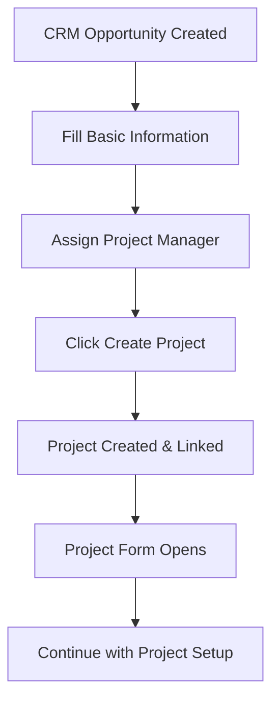
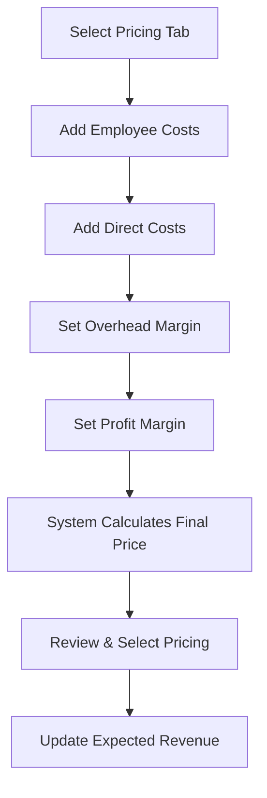
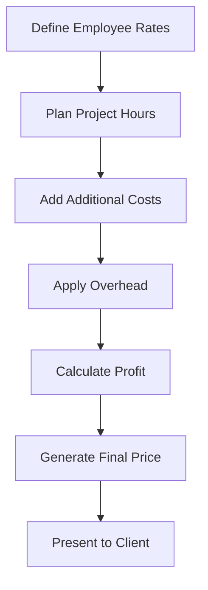

# Business Requirements Document (BRD)
## CRM Project Pricing Tools Module

**Document Version:** 1.0  
**Date:** December 2024  
**Author:** Ibraheem Areeda 
**Target Audience:** Development Interns  

---

## 1. Executive Summary

### 1.1 Purpose
This document outlines the business requirements for developing a comprehensive CRM Project Pricing Tools module that integrates project management capabilities with advanced pricing calculations within Odoo 18.

### 1.2 Business Problem
Organizations need a seamless way to:
- Convert CRM opportunities into projects
- Calculate accurate project costs with multiple pricing scenarios
- Track employee costs, overhead, and profit margins
- Make informed pricing decisions based on comprehensive cost analysis

### 1.3 Solution Overview
The CRM Project Pricing Tools module extends Odoo's CRM functionality to provide:
- **Project Integration**: Direct project creation from CRM opportunities
- **Three-Tier Pricing System**: Multiple pricing scenarios for different market conditions
- **Cost Management**: Employee costs, direct costs, overhead calculations
- **Profit Analysis**: Automated profit margin calculations and final pricing

---

## 2. Business Objectives

### 2.1 Primary Objectives
1. **Streamline Project Creation**: Enable one-click project creation from CRM opportunities
2. **Accurate Cost Calculation**: Provide detailed cost breakdowns for informed pricing decisions
3. **Multiple Pricing Scenarios**: Support three different pricing models for market flexibility
4. **Profit Optimization**: Automate profit margin calculations and pricing recommendations

### 2.2 Success Metrics
- **Time Reduction**: 50% reduction in project setup time
- **Accuracy Improvement**: 95% accuracy in cost calculations
- **Decision Speed**: 75% faster pricing decisions
- **User Adoption**: 90% of sales team using the module within 3 months

---

## 3. Stakeholder Analysis

### 3.1 Primary Stakeholders

| Role                | Responsibilities                     | Pain Points                                |
|---------------------|--------------------------------------|--------------------------------------------|
| **Sales Manager**   | Lead management, pricing decisions   | Manual cost calculations, project setup delays |
| **Project Manager** | Project execution, resource allocation | Disconnected CRM and project data            |
| **Sales Rep.**      | Opportunity management, client communication | Lack of pricing tools, manual processes     |
| **Finance Team**    | Cost tracking, profit analysis       | Inconsistent pricing, manual calculations   |

### 3.2 Secondary Stakeholders
- **HR Team**: Employee cost data management
- **IT Administrator**: System maintenance and user access
- **Executive Team**: Business performance monitoring

---

## 4. Functional Requirements

### 4.1 Core Features

#### 4.1.1 Project Integration
**Requirement ID:** FR-001  
**Priority:** High  
**Description:** Enable seamless project creation from CRM opportunities

**Acceptance Criteria:**
- Users can create projects directly from CRM lead forms
- Projects are automatically linked to originating CRM opportunities
- Project manager assignment is supported
- Bidirectional relationship between CRM leads and projects

**Business Rules:**
- One CRM lead can have only one associated project
- Project creation requires valid CRM opportunity data
- Project manager must be an active employee

#### 4.1.2 Three-Tier Pricing System
**Requirement ID:** FR-002  
**Priority:** High  
**Description:** Implement three different pricing scenarios for market flexibility

**Acceptance Criteria:**
- **Price One**: Basic pricing with standard margins
- **Price Two**: Advanced pricing with competitive margins
- **Price Three**: Premium pricing with high margins
- Users can select preferred pricing option
- Final price automatically updates CRM expected revenue

**Business Rules:**
- Each pricing tier has independent cost calculations
- Users must select a pricing option before marking opportunity as "Won"
- Pricing calculations are real-time and automatic

#### 4.1.3 Employee Cost Management
**Requirement ID:** FR-003  
**Priority:** High  
**Description:** Track and calculate employee-related project costs

**Acceptance Criteria:**
- Employee hourly rates are configurable
- Planned hours tracking per employee
- Automatic calculation of employee costs (rate × hours)
- Support for multiple employees per pricing scenario

**Business Rules:**
- Employee hourly rates must be positive values
- Planned hours cannot be negative
- Employee must be active in the system

#### 4.1.4 Direct Cost Tracking
**Requirement ID:** FR-004  
**Priority:** Medium  
**Description:** Manage additional project costs beyond employee expenses

**Acceptance Criteria:**
- Support for flight costs, hotel expenses, per diem
- Configurable cost categories
- Automatic total calculations
- Cost tracking per pricing scenario

**Business Rules:**
- All cost amounts must be non-negative
- Cost categories are predefined but extensible
- Costs are tracked separately for each pricing tier

#### 4.1.5 Overhead and Profit Calculations
**Requirement ID:** FR-005  
**Priority:** High  
**Description:** Automated overhead and profit margin calculations

**Acceptance Criteria:**
- Configurable overhead percentage applied to employee costs
- Configurable profit margin percentage
- Support for fixed profit margin amounts
- Real-time calculation of final project prices

**Business Rules:**
- Overhead is applied only to employee costs
- Profit margin can be percentage-based or fixed amount
- Final price = (Employee Cost + Overhead) + Direct Costs + Profit

### 4.2 User Interface Requirements

#### 4.2.1 CRM Lead Enhancement
**Requirement ID:** FR-006  
**Priority:** High  
**Description:** Enhance CRM lead forms and views with project and pricing information

**Acceptance Criteria:**
- Project information section in lead forms
- Project creation/view buttons in form headers
- Project status display in kanban cards
- Three pricing tabs in lead forms

**Business Rules:**
- Project buttons only visible to users with project access
- Pricing tabs only visible to pricing tool administrators
- Kanban cards show project status when available

#### 4.2.2 Kanban View Enhancement
**Requirement ID:** FR-007  
**Priority:** Medium  
**Description:** Display project information in CRM kanban cards

**Acceptance Criteria:**
- Project name display with folder icon
- Project manager with avatar widget
- Project status badge
- Create/View project action buttons

**Business Rules:**
- Project section only visible when project exists
- Action buttons context-sensitive (create vs. view)
- Consistent visual styling with Odoo standards

### 4.3 Data Management Requirements

#### 4.3.1 Data Validation
**Requirement ID:** FR-008  
**Priority:** High  
**Description:** Ensure data integrity and consistency

**Acceptance Criteria:**
- Prevent negative cost values
- Validate employee assignments
- Ensure unique project-lead relationships
- Prevent pricing type changes after creation

**Business Rules:**
- All monetary fields must be non-negative
- Employee must be active and valid
- One-to-one relationship between leads and projects
- Pricing type is immutable after record creation

#### 4.3.2 Data Relationships
**Requirement ID:** FR-009  
**Priority:** High  
**Description:** Maintain proper data relationships and referential integrity

**Acceptance Criteria:**
- CRM leads linked to projects
- Pricing lines linked to leads and employees
- Direct costs linked to leads and pricing types
- Automatic cleanup on record deletion

**Business Rules:**
- Cascade delete pricing lines when lead is deleted
- Maintain referential integrity across all relationships
- Support for orphaned record cleanup

---

## 5. Non-Functional Requirements

### 5.1 Performance Requirements
- **Response Time**: Form loads within 2 seconds
- **Calculation Speed**: Pricing calculations complete within 1 second
- **Concurrent Users**: Support 50+ simultaneous users
- **Data Volume**: Handle 10,000+ pricing lines per opportunity

### 5.2 Security Requirements
- **Access Control**: Role-based access to pricing tools
- **Data Protection**: Secure handling of financial data
- **Audit Trail**: Track all pricing changes and calculations
- **User Permissions**: Granular permissions for different user roles

### 5.3 Usability Requirements
- **User Interface**: Intuitive and consistent with Odoo standards
- **Learning Curve**: New users productive within 2 hours
- **Error Handling**: Clear error messages and validation feedback
- **Mobile Support**: Responsive design for mobile devices

### 5.4 Integration Requirements
- **Odoo Compatibility**: Full compatibility with Odoo 18
- **Module Dependencies**: Integration with CRM, Project, HR, and Sale modules
- **API Support**: RESTful API for external integrations
- **Data Export**: Support for data export and reporting

---

## 6. Business Process Flows

### 6.1 Project Creation Process

### 6.2 Pricing Calculation Process

### 6.3 Cost Management Process

---

## 7. Data Requirements

### 7.1 Core Data Entities

#### 7.1.1 CRM Lead Extensions
- **project_id**: Link to project.project
- **project_manager_id**: Link to hr.employee
- **selected_pricing**: Chosen pricing option
- **selected_final_price**: Final calculated price

#### 7.1.2 Pricing Lines
- **employee_id**: Assigned employee
- **hourly_cost**: Employee hourly rate
- **planned_hours**: Estimated hours
- **flight_cost**: Travel expenses
- **night_cost**: Hotel costs
- **perdiem_cost**: Daily allowances

#### 7.1.3 Direct Costs
- **other_cost**: Cost description
- **cost_amount**: Cost value
- **pricing_type**: Associated pricing tier

### 7.2 Data Validation Rules
- All monetary fields: Non-negative values
- Employee assignments: Active employees only
- Hours tracking: Non-negative values
- Pricing types: Immutable after creation

---

## 8. User Stories

### 8.1 Sales Manager Stories
- **As a Sales Manager**, I want to create projects from CRM opportunities so that I can streamline project setup
- **As a Sales Manager**, I want to compare three pricing scenarios so that I can make informed pricing decisions
- **As a Sales Manager**, I want to see project status in CRM kanban so that I can track project progress

### 8.2 Sales Representative Stories
- **As a Sales Representative**, I want to calculate accurate project costs so that I can provide competitive quotes
- **As a Sales Representative**, I want to assign project managers so that I can ensure proper project oversight
- **As a Sales Representative**, I want to track all project expenses so that I can maintain profitability

### 8.3 Project Manager Stories
- **As a Project Manager**, I want to see CRM context in projects so that I can understand client requirements
- **As a Project Manager**, I want to track resource costs so that I can manage project budgets
- **As a Project Manager**, I want to monitor project profitability so that I can optimize resource allocation

---

## 9. Acceptance Criteria

### 9.1 Project Integration
- ✅ Users can create projects from CRM opportunities with one click
- ✅ Projects are automatically linked to originating opportunities
- ✅ Project managers can be assigned during project creation
- ✅ Bidirectional navigation between CRM and projects

### 9.2 Pricing System
- ✅ Three independent pricing scenarios are available
- ✅ Each pricing scenario calculates costs independently
- ✅ Users can select preferred pricing option
- ✅ Final prices are automatically calculated and displayed

### 9.3 Cost Management
- ✅ Employee costs are calculated as rate × hours
- ✅ Direct costs can be added and tracked
- ✅ Overhead is applied to employee costs only
- ✅ Profit margins are configurable and applied correctly

### 9.4 User Interface
- ✅ Project information is clearly displayed in CRM forms
- ✅ Kanban cards show project status and actions
- ✅ Pricing tabs are intuitive and easy to use
- ✅ All calculations are real-time and accurate

---

## 10. Implementation Phases

### 10.1 Phase 1: Core Project Integration (Week 1-2)
- CRM lead model extensions
- Project creation functionality
- Basic project linking
- Form view enhancements

### 10.2 Phase 2: Pricing System (Week 3-4)
- Three-tier pricing structure
- Employee cost calculations
- Direct cost management
- Overhead and profit calculations

### 10.3 Phase 3: User Interface (Week 5-6)
- Kanban view enhancements
- Pricing tab implementation
- Action buttons and navigation
- User experience optimization

### 10.4 Phase 4: Testing & Refinement (Week 7-8)
- Comprehensive testing
- Performance optimization
- User acceptance testing
- Documentation and training

---

## 11. Risk Assessment

### 11.1 Technical Risks
| Risk | Impact | Probability | Mitigation |
|------|--------|-------------|------------|
| Performance issues with large datasets | High | Medium | Implement caching and optimization |
| Integration conflicts with other modules | Medium | Low | Thorough testing and compatibility checks |
| Data migration challenges | Medium | Low | Comprehensive backup and rollback procedures |

### 11.2 Business Risks
| Risk | Impact | Probability | Mitigation |
|------|--------|-------------|------------|
| User adoption resistance | High | Medium | Training and change management |
| Incorrect cost calculations | High | Low | Extensive testing and validation |
| Security vulnerabilities | High | Low | Security audits and best practices |

---

## 12. Success Criteria

### 12.1 Technical Success
- ✅ Module installs without errors
- ✅ All calculations are accurate
- ✅ Performance meets requirements
- ✅ No data integrity issues

### 12.2 Business Success
- ✅ 90% user adoption within 3 months
- ✅ 50% reduction in project setup time
- ✅ 95% accuracy in cost calculations
- ✅ Positive user feedback and satisfaction

---

## 13. Appendices

### 13.1 Glossary
- **CRM Lead**: Sales opportunity or potential customer
- **Pricing Line**: Individual cost item in pricing calculation
- **Direct Cost**: Additional project expenses beyond employee costs
- **Overhead**: Additional percentage applied to employee costs
- **Profit Margin**: Percentage or fixed amount added for profit

### 13.2 References
- Odoo 18 Documentation
- CRM Module Specifications
- Project Module Specifications
- HR Module Specifications

### 13.3 Change Log
| Version | Date | Changes | Author |
|---------|------|---------|--------|
| 1.0 | Dec 2024 | Initial BRD creation |Ibraheem Areeda|

---

**Document Status:** Draft  

